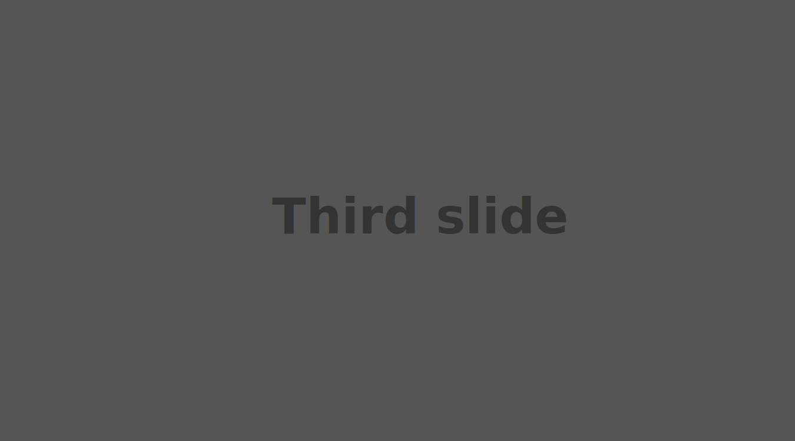

# CF:G Session 7

---

### Exercise 1
 - Login to Github and fork this repository.
 - Open up the Github desktop app and clone the forked repository
 - Set up Github pages
 - Investigate the files in the repository
  - Which files are included in the repository and what is their main function?

### Exercise 2
- Lets add a navigation menu to our page
 - http://getbootstrap.com/components/#navbar
- **Task**: change the background colour of the navigation menu to any colour you wish
 - us this site to find colours: https://coolors.co/app

```
<!-- Navbar start -->
<nav class="navbar navbar-default">
    <div class="container-fluid">
        <!-- Brand and toggle get grouped for better mobile display -->
        <div class="navbar-header">
            <button type="button" class="navbar-toggle collapsed" data-toggle="collapse" data-target="#bs-example-navbar-collapse-1" aria-expanded="false">
                <span class="sr-only">Toggle navigation</span>
                <span class="icon-bar"></span>
                <span class="icon-bar"></span>
                <span class="icon-bar"></span>
            </button>
            <a class="navbar-brand" href="#">Brand</a>
        </div>

        <!-- Collect the nav links, forms, and other content for toggling -->
        <div class="collapse navbar-collapse" id="bs-example-navbar-collapse-1">
        <ul class="nav navbar-nav">
            <li class="active"><a href="#">Link <span class="sr-only">(current)</span></a></li>
            <li><a href="#">Link</a></li>
            <li class="dropdown">
            <a href="#" class="dropdown-toggle" data-toggle="dropdown" role="button" aria-haspopup="true" aria-expanded="false">Dropdown <span class="caret"></span></a>
            <ul class="dropdown-menu">
                <li><a href="#">Action</a></li>
                <li><a href="#">Another action</a></li>
                <li><a href="#">Something else here</a></li>
                <li role="separator" class="divider"></li>
                <li><a href="#">Separated link</a></li>
                <li role="separator" class="divider"></li>
                <li><a href="#">One more separated link</a></li>
              </ul>
            </li>
        </ul>
      <form class="navbar-form navbar-left">
        <div class="form-group">
          <input type="text" class="form-control" placeholder="Search">
        </div>
        <button type="submit" class="btn btn-default">Submit</button>
      </form>
      <ul class="nav navbar-nav navbar-right">
        <li><a href="#">Link</a></li>
        <li class="dropdown">
          <a href="#" class="dropdown-toggle" data-toggle="dropdown" role="button" aria-haspopup="true" aria-expanded="false">Dropdown <span class="caret"></span></a>
          <ul class="dropdown-menu">
            <li><a href="#">Action</a></li>
            <li><a href="#">Another action</a></li>
            <li><a href="#">Something else here</a></li>
            <li role="separator" class="divider"></li>
            <li><a href="#">Separated link</a></li>
          </ul>
        </li>
      </ul>
    </div><!-- /.navbar-collapse -->
    </div><!-- /.container-fluid -->
</nav>
<!-- Navbar end -->
```

### Exercise 3
- Lets add a carousel to our page
 - http://getbootstrap.com/javascript/#carousel
- **Task**: add the three slide images to the carousel (slide_1.svg, slide_2.svg, slide_3.svg)

```
<div class="row">
    <!-- Carousel start -->
    <div id="carousel-example-generic" class="carousel slide" data-ride="carousel">
      <!-- Indicators -->
      <ol class="carousel-indicators">
        <li data-target="#carousel-example-generic" data-slide-to="0" class="active"></li>
        <li data-target="#carousel-example-generic" data-slide-to="1"></li>
        <li data-target="#carousel-example-generic" data-slide-to="2"></li>
      </ol>

      <!-- Wrapper for slides -->
      <div class="carousel-inner" role="listbox">
        <div class="item active">
          
          <div class="carousel-caption">
            Caption for slide 1
          </div>
        </div>
        <div class="item">
          
          <div class="carousel-caption">
            Caption for slide 2
          </div>
        </div>
        <div class="item">
          
          <div class="carousel-caption">
            Caption for slide 3
          </div>
        </div>
      </div>

      <!-- Controls -->
      <a class="left carousel-control" href="#carousel-example-generic" role="button" data-slide="prev">
        <span class="glyphicon glyphicon-chevron-left" aria-hidden="true"></span>
        <span class="sr-only">Previous</span>
      </a>
      <a class="right carousel-control" href="#carousel-example-generic" role="button" data-slide="next">
        <span class="glyphicon glyphicon-chevron-right" aria-hidden="true"></span>
        <span class="sr-only">Next</span>
      </a>
    </div>
    <!-- Carousel end -->
</div>
```

### Exercise 4
- Lets add a new row with two columns to hold the pictures of Silvio and Donald.
- Also add some dummy text from http://www.lipsum.com/

```
<div class="row">

    <div class="col-xs-6 text-center">
        
        <h2>Heading</h2>
        <p>Donec sed odio dui. Etiam porta sem malesuada magna mollis euismod. Nullam id dolor id nibh ultricies vehicula ut id elit. Morbi leo risus, porta ac consectetur ac, vestibulum at eros. Praesent commodo cursus magna.</p>
        <button class="btn btn-secondary" href="#" role="button">View details</button>
    </div>

    <div class="col-xs-6 text-center">
        
        <h2>Heading</h2>
        <p>Donec sed odio dui. Etiam porta sem malesuada magna mollis euismod. Nullam id dolor id nibh ultricies vehicula ut id elit. Morbi leo risus, porta ac consectetur ac, vestibulum at eros. Praesent commodo cursus magna.</p>
        <button class="btn btn-secondary" href="#" role="button">View details</button>
    </div>

</div>
```

### Exercise 5
- Lets add two buttons which when pressed cycles through a series of gifs that were imported from the Reddit API.

```
<div class="row">
    <div class="col-xs-2 text-center">
      <button id="button1" class="btn btn-secondary">Prev</button>
    </div>
    <div class="col-xs-8 text-center">
      <h5 id="loading_text"></h5>
      
    </div>
    <div class='col-xs-2 text-center'>
      <button id="button2" class="btn btn-secondary">Next</button>
    </div>

</div>
```

```
$( document ).ready(function() {
    console.log( "Dom is ready!" );

    var reddit_url = 'https://www.reddit.com/r/perfectloops/top.json?sort=top&t=week';
    var gif_urls = [];
    var gif_index = 0;

    $.ajax(reddit_url).done(function(response) {
        //console.log(response);

        gif_urls = response.data.children.filter( function(post) { return !post.data.over_18 })

        gif_urls = gif_urls.map( function(post) {

            var url = post.data.url;

            if(url.endsWith('.gifv')) {
                url = url.replace(/v$/,'')
            }

            return url;
        } );

        gif_urls = gif_urls.filter( function(url) { return  url.endsWith('.gif') });

        console.log(gif_urls)

        $("#gif_goes_here").attr('src', gif_urls[0]);
    });

    $("#gif_goes_here").on('load', done_loading)

    function loading() {
        $("#loading_text").html("loading ...")
    }

    function done_loading() {
        $("#loading_text").html("")
    }

    //prev
    $("#button1").click(function() {
        gif_index--;

        if(gif_index < 0) {
            gif_index = gif_urls.length;
        }

        loading();
        $("#gif_goes_here").attr('src', gif_urls[gif_index]);
    });

    //next
    $("#button2").click(function() {
        gif_index++;

        if(gif_index > gif_urls.length) {
            gif_index = 0;
        }

        loading();
        $("#gif_goes_here").attr('src', gif_urls[gif_index]);
    });

});
```
